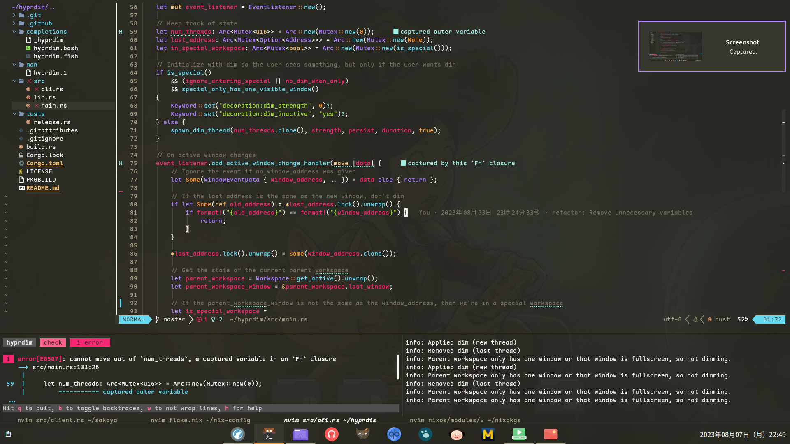

# nix-config

My [NixOS] configuration with [Nix Flakes], [Home Manager], [Stylix], and [Hyprland].


<sub>Background: ["Video game jam"](https://www.peppercarrot.com/en/viewer/misc__2023-06-12_video-game-jam_by-David-Revoy.html) by David Revoy, licensed under [Creative Commons Attribution 4.0](https://creativecommons.org/licenses/by/4.0/deed.en).</sub>

## Features

- Clean, readable code that can be easily modified to add/remove things as needed.
- Fully reproducible and declarative environment thanks to NixOS.
- Reasonably secure containers isolated from your personal files and network.
- Nix Flakes + Home Manager + Btrfs on LUKS.
- Simple yet effective Neovim setup with nvim-lspconfig.
- Modern Wayland support with Hyprland and the master-stack layout.
- Full Japanese support with fonts, input method, and wine covered.
- Specializations for easy switching between Hyprland, GNOME, and Plasma.
- A universal color scheme inherited by all applications.

## Usage

```fish
git clone https://github.com/donovanglover/nix-config && cd nix-config
nixos-rebuild build-vm --flake .#nixos
./result/bin/run-nixos-vm
```

The code base is designed to be small so it's easy to adjust things as needed. Have fun!

[NixOS]: https://nixos.org/
[Nix Flakes]: https://nixos.wiki/wiki/Flakes
[Home Manager]: https://nix-community.github.io/home-manager/
[Stylix]: https://danth.github.io/stylix/
[Hyprland]: https://hyprland.org/
