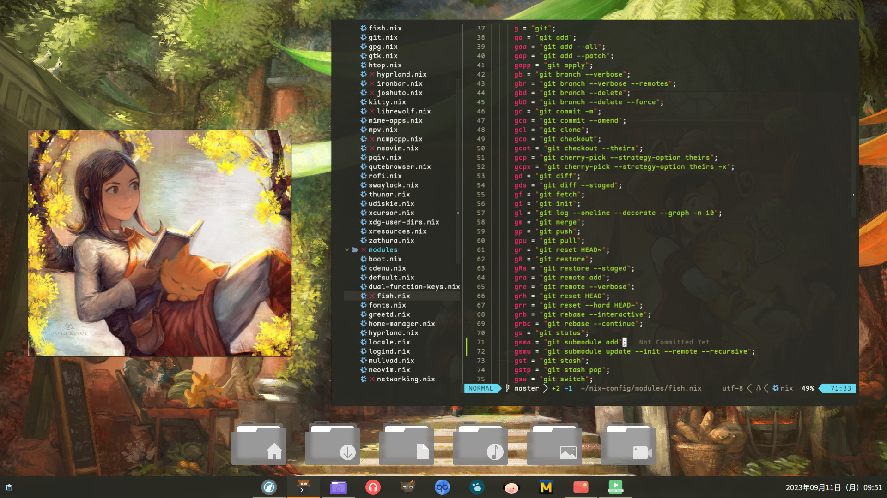
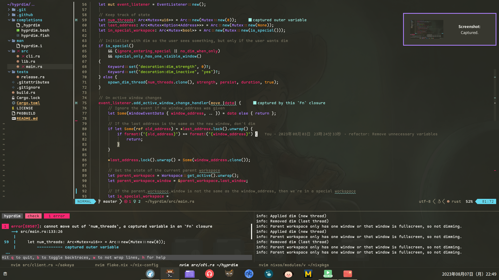

<div align="right">
  <details>
    <summary >🌐 Language</summary>
    <div>
      <div align="center">
        <a href="https://openaitx.github.io/view.html?user=donovanglover&project=nix-config&lang=en">English</a>
        | <a href="https://openaitx.github.io/view.html?user=donovanglover&project=nix-config&lang=zh-CN">简体中文</a>
        | <a href="https://openaitx.github.io/view.html?user=donovanglover&project=nix-config&lang=zh-TW">繁體中文</a>
        | <a href="https://openaitx.github.io/view.html?user=donovanglover&project=nix-config&lang=ja">日本語</a>
        | <a href="https://openaitx.github.io/view.html?user=donovanglover&project=nix-config&lang=ko">한국어</a>
        | <a href="https://openaitx.github.io/view.html?user=donovanglover&project=nix-config&lang=hi">हिन्दी</a>
        | <a href="https://openaitx.github.io/view.html?user=donovanglover&project=nix-config&lang=th">ไทย</a>
        | <a href="https://openaitx.github.io/view.html?user=donovanglover&project=nix-config&lang=fr">Français</a>
        | <a href="https://openaitx.github.io/view.html?user=donovanglover&project=nix-config&lang=de">Deutsch</a>
        | <a href="https://openaitx.github.io/view.html?user=donovanglover&project=nix-config&lang=es">Español</a>
        | <a href="https://openaitx.github.io/view.html?user=donovanglover&project=nix-config&lang=it">Italiano</a>
        | <a href="https://openaitx.github.io/view.html?user=donovanglover&project=nix-config&lang=ru">Русский</a>
        | <a href="https://openaitx.github.io/view.html?user=donovanglover&project=nix-config&lang=pt">Português</a>
        | <a href="https://openaitx.github.io/view.html?user=donovanglover&project=nix-config&lang=nl">Nederlands</a>
        | <a href="https://openaitx.github.io/view.html?user=donovanglover&project=nix-config&lang=pl">Polski</a>
        | <a href="https://openaitx.github.io/view.html?user=donovanglover&project=nix-config&lang=ar">العربية</a>
        | <a href="https://openaitx.github.io/view.html?user=donovanglover&project=nix-config&lang=fa">فارسی</a>
        | <a href="https://openaitx.github.io/view.html?user=donovanglover&project=nix-config&lang=tr">Türkçe</a>
        | <a href="https://openaitx.github.io/view.html?user=donovanglover&project=nix-config&lang=vi">Tiếng Việt</a>
        | <a href="https://openaitx.github.io/view.html?user=donovanglover&project=nix-config&lang=id">Bahasa Indonesia</a>
        | <a href="https://openaitx.github.io/view.html?user=donovanglover&project=nix-config&lang=as">অসমীয়া</
      </div>
    </div>
  </details>
</div>

# nix-config

My [NixOS] configuration with [Nix Flakes], [Home Manager], [Stylix], and [Hyprland].


<sub>Background art: [The market](https://www.peppercarrot.com/en/viewer/artworks__2022-02-21_The-market_by-David-Revoy.html), [In Bloom](https://www.peppercarrot.com/en/viewer/artworks__2022-03-02_In-Bloom_by-David-Revoy.html) and [Vertical cover book two screen](https://www.peppercarrot.com/en/viewer/artworks__2016-11-14_vertical-cover-book-two_screen_by-David-Revoy.html) by David Revoy − [CC-BY 4.0](https://creativecommons.org/licenses/by/4.0/deed.en).</sub>


<sub>Background art: [Video game jam](https://www.peppercarrot.com/en/viewer/misc__2023-06-12_video-game-jam_by-David-Revoy.html) by David Revoy − [CC-BY 4.0](https://creativecommons.org/licenses/by/4.0/deed.en).</sub>

## Features

- Clean, readable code that can be easily modified to add/remove things as needed.
- Fully reproducible and declarative environment thanks to NixOS.
- Reasonably secure containers isolated from your personal files and network.
- Nix Flakes + Home Manager + Btrfs on LUKS.
- Simple yet effective Neovim setup with nvim-lspconfig.
- Modern Wayland support with Hyprland and the master-stack layout.
- Easily switch to a similar dwm config if X is necessary.
- Full Japanese support with fonts, input method, and wine covered.
- A universal color scheme inherited by all applications.

## Usage

```fish
git clone https://github.com/donovanglover/nix-config && cd nix-config
nixos-rebuild build-vm --flake .#nixos
./result/bin/run-nixos-vm
```

The code base is designed to be small so it's easy to adjust things as needed. Have fun!

[NixOS]: https://nixos.org/
[Nix Flakes]: https://wiki.nixos.org/wiki/Flakes
[Home Manager]: https://nix-community.github.io/home-manager/
[Stylix]: https://danth.github.io/stylix/
[Hyprland]: https://hyprland.org/
